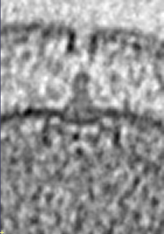

# Summer 2023 Research Journal

## Things on my TODO list
- [ ] ACE Table
	- [x] fix ACE data
- [ ] Get final tomogram data 
	- dirs of each set of tomogram pngs
	- slice range are going to be max_z + 30 and min_z - 30
	- bounding box is going to be (60,60)
- [ ] Review Paper
- [ ] Write Paper 

## 08/09/23

Differences in energy calculations for grain boundary predictions and atom predictions. The important thing to remember here is that our intent is to find meaning behind grain boundary structure.


## 08/07/23

The Tomogram data need to be better explained. Filenames is not enough to go off of. I hereby promise to always include a README.txt in everything I ever do the rest of my life.

### Lets play "Whats That Structure?!"

- Campylobacter_jejuni
	 - 

## 08/04/23
I found the problem. I was doing two things wrong:
1. I was dividing each ace vector by the amount of atoms. This most likely due to some copy and paste error. But mostly because I did not take the time to truly understand what was happening.
2. amr is terrible. All i need to do is np.average(a,axis=0)


## 08/03/23

ace_amr numpy array in ace_julia is not the same as the one in lagspace. I need to figure out why.

- things to test:
	- make sure averaging is the same
	- check parameters
	- Can we recreate the same numpy array in ace_julia?

This is the script given to me by the organizers of ACE https://github.com/ACEsuit/ACEfit.jl/issues/28 which averages each atom representation.

### FOUND IT
The file, test.jl in fslg_gblearn/braxton/descriptors/ace returns the same values as ace_julia.
Still don't know exactly why.

### Rendir Quentas
Today was a good day, found some important mistakes I made. I need to get table done first thing tomorrow. Might have to postpone because I might have to rerun all ACE.

### Fixed Length Methods
- PDF
- Kmeans
	- both with and without PCA
	- both Kernel and non-kernel PCA
- CUR
- LDF

### Hyperparameter Tuning
- Preprocessing data
- grid search


## 08/02/23
- [ ] get bounding box size for each bacteria and append to csv.
- [ ] get under 20G of data for as many species as possible.
- [ ] upload data to kaggle and add important information to description.
- [x] 3 hours to writing gbcompare paper. No excuses. Write better goals for writing.
- [x] Run quench scripts with increased size for all sigma 3, see homer chat. 

TODO:
- [ ] ML/Descriptor/Fix table for ACE

### Rendir Quentas
Writing does not come easily for me. If I am not actively writing on a daily basis the paper become a complex puzzle. Almost like each word is a parameter that needs to be optimized and placed correctly. By doing it before anything else I found that starting is the hard part. Spending time writing makes the puzzle seem doable.

I also forgot to push for Gus, shame on me.

## 08/01/2023

- [x] 10:30 - 11:00 CFM
- [x] 11:00 - 12:30 Find fixed edge length and range of slices for each bacteria.
- [ ] 12:30 - 5:00 GBC paper

### How to use 3dmod on supercomputer with macOS

1. install XQuartz
	- https://www.xquartz.org/ 
2. login to the supercomputer using -X flag i.e. 'ssh -X username@ssh.rc.byu.edu'
	- -X flag allows you to open graphical applications on the supercomputer
3. open the terminal and allocate time on a job node. i.e. 'salloc --time=2:00:00 --mem=2G --x11'
	- --time is the amount of time you want to allocate
	- --mem is the amount of memory you want to allocate
	- --x11 is to open a graphical session
3. Download the IMOD install bash script [here](https://bio3d.colorado.edu/imod/AMD64-RHEL5/imod_4.11.24_RHEL7-64_CUDA10.1.sh)
4. Run the bash script. i.e. 'bash -skip -dir ~/Downloads imod_4.11.24_RHEL7-64_CUDA10.1.sh'
	- -skip keeps the script from editing any user files. you need this because it attempts to edit .profile which you cannot edit.
	- -dir is the directory where you want to install IMOD. You need this because you don't have permission to install it in the default location. /usr/local/
5. run 'source ~/Downloads/IMOD/IMOD-linux.sh' to add IMOD to your path.
6. Now anywhere you can run '3dmod' to open 3dmod.

### Reading mod files using imodinfo

```bash
#!/bin/bash

for modfile in yc*/fm.mod
do
        moddir=$(dirname $modfile)
        imodinfo -a $modfile | grep '^slicerAngle' | awk '{print $(NF-2)","$(NF-1)","$NF}' > $moddir/contour_fm.csv
done
```
This script will go through all the directories in the current directory and find all the fm.mod files. It will then use imodinfo to read the slicerAngle from the mod file and write it to a csv file in the same directory as the mod file.

### SSH config
IF you want to open a software on the supercomputer and have it open on your computer you can use the following ssh config. This will allow you to open 3dmod on the supercomputer and have it open on your computer.

```bash
Host sc
	Hostname ssh.rc.byu.edu
	User cbo27
	ForwardX11 yes
	ControlMaster auto
	ControlPath ~/.ssh/master-%r@%h:%p.socket
	ControlPersist yes
	ServerAliveInterval 300
```
`ForwardX11 yes` is the important line. This tells ssh to forward the X11 session to your computer. You can then open 3dmod on the supercomputer and it will open on your computer.

You might come across an issue where xQuartz does not open when logging in with host. This might be because the master port at `ControlPath` was not opened with forwarding. To fix this you can run `ssh -O exit -S ~/.ssh/master-%r@%h:%p.socket sc` to close the master port. Then you can run `ssh sc` to open a new master port with forwarding.

NOTE: It is important to close xQuartz after you leave your session

## 08/01/23 Rendir Quentas
I find myself prioritizing BIG(Biophical Image Group) research over writing the gbcompare paper. Only worked on this from 4-5pm.

Things were kinda slow with finding the fixed edge length and tomogram slices for each bacteria. I decided that the range of slices to be 10 minus the min of the picked slices to 10 plus the max of the picked slices. So the sizes wont be the same for each one so it is going to be up to the user to make it work. As far as a bounding box size, I need to see if they are all the same even across different bacteria species. 
